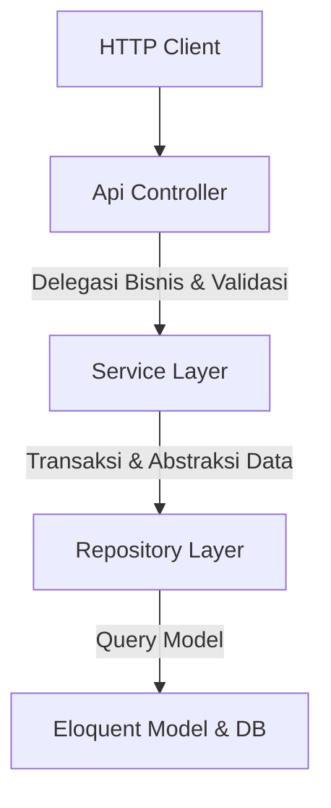

# Computer Based Test (CBT) API Backend

CBT API Backend adalah sistem manajemen ujian berbasis komputer yang dirancang menggunakan **Laravel 13** dan **PHP 8.2+**. Backend ini mengimplementasikan **Clean Architecture** dengan pola **Service-Repository** untuk memisahkan logika bisnis dari lapisan presentasi/HTTP, serta menggunakan standar modern Laravel 13 untuk penulisan Model.

---

## 🚀 Fitur Utama
1.  **Engine Simulasi CPNS**:
    *   Mendukung format ujian CPNS dengan kategori khusus: **TIU** (Tes Inteligensia Umum), **TWK** (Tes Wawasan Kebangsaan), dan **TKP** (Tes Karakteristik Pribadi).
    *   Penilaian otomatis terpisah berdasarkan KKM (Kriteria Ketuntasan Minimal) per kategori dan akumulasi nilai ambang batas.
2.  **Manajemen Ujian & Sesi (Assessment & Session)**:
    *   Pengaturan acak soal (*randomize questions*) dan acak opsi jawaban (*randomize options*).
    *   Sistem pembatasan durasi ujian (*timer*) dengan fitur *force-submit* otomatis jika waktu habis.
    *   Kemudahan monitoring aktivitas peserta secara *real-time*.
3.  **Analisis Butir Soal & Dashboard**:
    *   **Item Analysis**: Mengkalkulasi tingkat kesulitan dan tingkat kesuksesan pengerjaan soal (*correctness rate*) untuk mengevaluasi kualitas bank soal.
    *   **Statistik Dashboard**: Rekapitulasi performa kelompok (rata-rata nilai & kelulusan KKM per Grup), status pelanggaran, dan tren pengerjaan ujian.
4.  **Sistem Pengawasan (Proctoring System)**:
    *   Pencatatan pelanggaran pengawasan secara otomatis (pindah tab, keluar layar penuh, dll.) untuk menjaga integritas ujian.
5.  **Impor Massal (Excel & CSV)**:
    *   Fitur unggah massal untuk bank soal beserta opsi dan bobot nilainya.
    *   Fitur unggah massal untuk data peserta beserta pembagian grupnya.
6.  **Sertifikat Digital**:
    *   Rilis sertifikat digital otomatis atau manual berdasarkan pencapaian skor KKM dengan template klasik/modern.

---

## 🏗️ Pola Desain (Design Pattern)
Projek ini menggunakan pola **Service-Repository** untuk mencapai keterbacaan kode yang maksimal (*Clean Code*):



*   **Controller**: Hanya berfungsi sebagai pintu masuk (entrypoint) request, validasi dasar, dan formatting output JSON via `ResponseHelper`.
*   **Service**: Menyimpan seluruh *business logic*, penanganan transaksi DB, streaming CSV, perhitungan skor, dan integrasi library pihak ketiga.
*   **Repository**: Berfungsi sebagai satu-satunya jembatan interaksi data ke Eloquent ORM.

---

## 🎨 Standar Penulisan Model (Laravel 13 Style)
Seluruh model pada aplikasi ini ditulis menggunakan standar modern Laravel 13:
1.  **PHP Attributes**: Menggunakan atribut bawaan PHP seperti `#[Fillable([...])]` dan `#[Hidden([...])]` untuk mendefinisikan kolom aman mass-assignment dan kolom tersembunyi.
2.  **Casts Method**: Mendefinisikan tipe data kolom menggunakan metode `casts(): array` (bukan properti `$casts = [...]`).
3.  **Strict Relations Return Types**: Setiap relasi memiliki penanda tipe return PHP yang eksplisit (misal: `BelongsTo`, `HasMany`, `BelongsToMany`, `HasOne`).

*Contoh Model:*
```php
namespace App\Models;

use Illuminate\Database\Eloquent\Model;
use Illuminate\Database\Eloquent\Attributes\Fillable;
use Illuminate\Database\Eloquent\Relations\BelongsTo;

#[Fillable(['name', 'parent_id', 'passing_grade'])]
class Category extends Model
{
    protected function casts(): array
    {
        return [
            'passing_grade' => 'decimal:2',
        ];
    }

    public function parent(): BelongsTo
    {
        return $this->belongsTo(Category::class, 'parent_id');
    }
}
```

---

## 🛠️ Stack Teknologi & Dependensi
*   **Core**: Laravel 13, PHP 8.2+
*   **Database**: MySQL / PostgreSQL / SQLite (Primary key menggunakan **ULID** untuk skalabilitas tinggi)
*   **Autentikasi**: JWT (JSON Web Token) via `php-open-source-saver/jwt-auth`
*   **Media**: Spatie Laravel Media Library (`spatie/laravel-medialibrary`)
*   **Excel/CSV**: Maatwebsite Excel (`maatwebsite/excel`)
*   **Roles & Permissions**: Spatie Permissions (`spatie/laravel-permission`)

---

## ⚙️ Panduan Instalasi

### 1. Klon Repositori
```bash
git clone <url-repository>
cd cbt-api-backend
```

### 2. Instal Dependensi Composer
```bash
composer install
```

### 3. Setup Lingkungan (.env)
Salin berkas `.env.example` ke `.env` dan konfigurasikan koneksi database Anda:
```bash
cp .env.example .env
php artisan key:generate
php artisan jwt:secret
```

### 4. Migrasi & Seeder Database
Untuk menyiapkan database bersih beserta data simulasi CPNS bawaan (50 soal TIU, 50 TWK, 50 TKP dengan KKM terpisah):
```bash
php artisan migrate:fresh --seed
```

### 5. Jalankan Server Lokal
```bash
php artisan serve
```
Secara default backend akan berjalan di `http://localhost:8000`.

---

## 🧪 Pengujian API (Postman / Insomnia)
Semua rute API terdaftar di bawah prefiks `/api/v1/`. Untuk melihat daftar rute yang tersedia:
```bash
php artisan route:list
```
